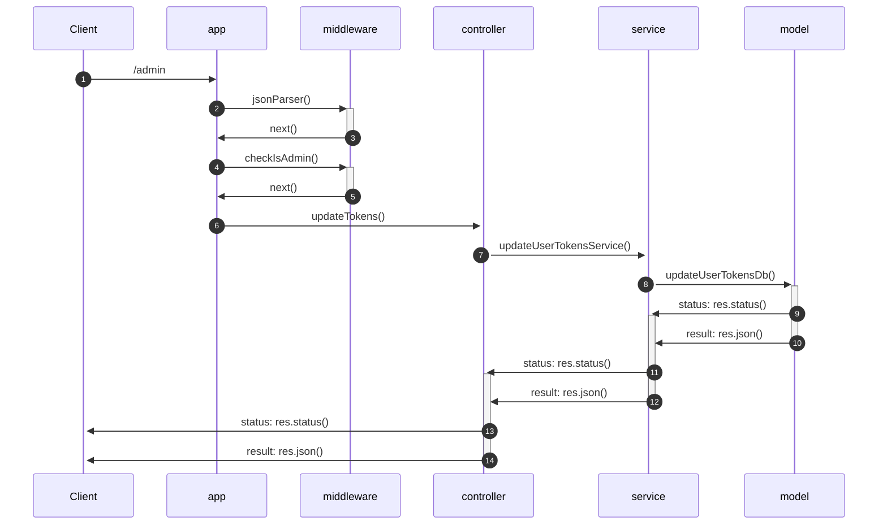

  

<a  href="#Indice">Indice</a>

<a  href="#Obiettivi del progetto">Obiettivi del progetto</a>&nbsp•
<a  href="#Progettazione">Progettazione</a>&nbsp•
<a  href="#Funzionamento">Funzionamento</a>&nbsp•
<a  href="#Testing">Testing</a>&nbsp•
<a  href="#Autori">Autori</a>

 
 

  

  

## Obiettivi del progetto

  
  
**Descrizione del progetto:**
*Le specifiche del progetto sono state fornite direttamente dal docente [*Adriano Mancini*](https://github.com/manciniadriano):
Si realizzi un sistema che consenta di gestire il gioco della battaglia navale. In particolare, il sistema deve prevedere la possibilità di far interagire due o tre utenti (autenticati mediante JWT) o un utente contro l’elaboratore. Ci possono essere più partite attive in un dato momento. Un utente può allo stesso tempo partecipare ad una ed una sola partita. Si chiede di sviluppare anche la possibilità di giocare contro l’elaboratore (di seguito IA). Nel caso di IA la logica può essere semplice (mosse randomiche all’interno della griglia) o tenere in considerazione lo storico delle mosse (es. cercare nei vicini); l’implementazione è carico del gruppo. Nel caso di gioco a tre player la turnazione deve essere A->B, C->A, B->C , C->B, A->C, B->A (il gioco potrebbe non essere equo)*

*Dare la possibilità di creare una nuova partita specificando (codifica a scelta dello studente):*
- *Tipologia: utente contro utente o utente contro IA o utente contro 2 utenti*
- *Dimensione della griglia *
- *Numero e tipologie delle imbarcazioni*
- *L’allocazione delle imbarcazioni è randomica (fatta all’atto della creazione).*
- *email dell’avversario o email degli avversari che sarà/saranno usata/e poi per autenticare le richieste mediante token JWT*

*Per ogni partita viene addebitato un numero di token in accordo con quanto segue:*
- *0.450 all’atto della creazione*
- *0.015 per ogni mossa da parte degli utenti (anche IA)*

*Il modello può essere creato se c’è credito sufficiente ad esaudire la richiesta (se il credito durante la partita scende sotto lo zero si può continuare comunque). *

- *Creare una rotta per effettuare una mossa in una data partita verificando se questa è ammissibile o meno.*
- *Creare una rotta per valutare lo stato di una data partita (di chi è il turno, se è terminata, vincitore,…)*
- *Creare una rotta per restituire lo storico delle mosse di una data partita con la possibilità di esportare in JSON (codifica a scelta del gruppo).*
- *Creare una rotta per restituire le statistiche di un utente ed in particolare: numero partite vinte, numero di partite perse, numero totale di partite giocate, numero min, massimo, media e deviazione standard delle mosse; dare la possibilità di filtrare per date (intervallo); dare la possibilità di restituire sotto forma di JSON o PDF (libreria a scelta del gruppo). *
- *Restituire la classifica dei giocatori dando la possibilità di scegliere l’ordinamento ascendente / discendente. Questa rotta è pubblica e non deve essere autenticata.*

*Le richieste devono essere validate (es. utente che scelga un evento che non esistente, payload non corretti dal punto di vista semantico, es. griglia con dimensione nulla o negativa.).*

*Ogni utente autenticato (ovvero con JWT) ha un numero di token (valore iniziale impostato nel seed del database).*

*Nel caso di token terminati ogni richiesta da parte dello stesso utente deve restituire 401 Unauthorized.*

*Prevedere una rotta per l’utente con ruolo admin che consenta di effettuare la ricarica per un utente fornendo la mail ed il nuovo “credito” (sempre mediante JWT). I token JWT devono contenere i dati essenziali.*

*Il numero residuo di token deve essere memorizzato nel db sopra citato.*

*Si deve prevedere degli script di seed per inizializzare il sistema. *

*Si chiede di utilizzare le funzionalità di middleware.* 

*Si chiede di gestire eventuali errori mediante gli strati middleware sollevando le opportune eccezioni.*

*Si chiede di commentare opportunamente il codice.*

## Progettazione

### Diagrammi UML

### Pattern utilizzati

#### MVCS
  
#### Middleware

#### Middleware

#### Middleware

## Funzionamento

## Testing

  

  

## Autori
- [*Longarini Lorenzo*](https://github.com/LorenzoLongarini)
- [*Ramovini Loris*](https://github.com/lorisramovini)

